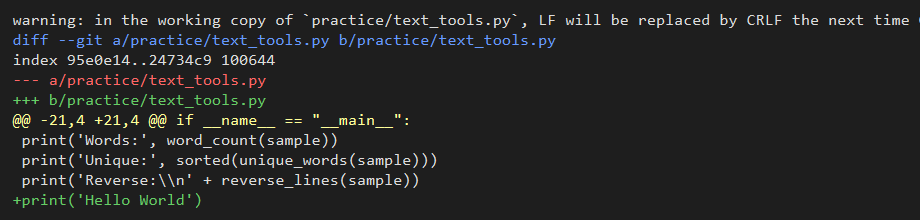
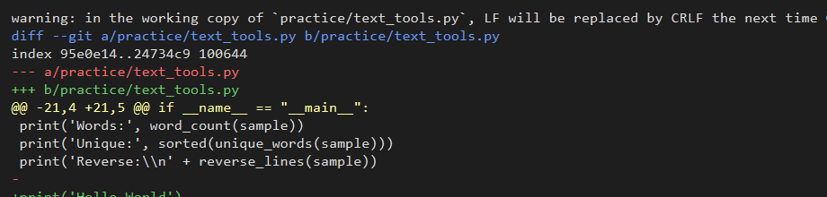
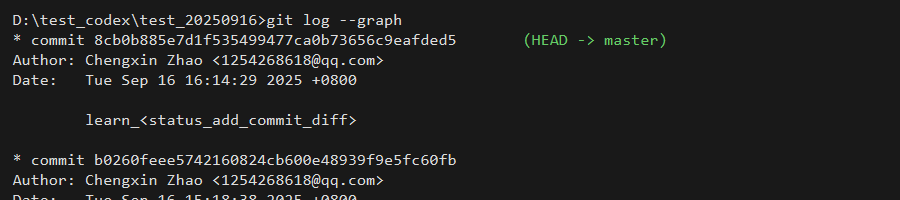

# QA 记录

目前用户的历史消息均为教学请求，暂无需要记录的 QA 项。

## Q1
**Q：** 如何通过 git 命令查看、删除和修改 config？
**A：**
- 查看：`git config --list --show-origin` 可同时看到配置来源；使用 `git config --global user.name` 查看特定键，仓库内使用 `git config user.name` 查看局部配置。
- 修改/新增：`git config --global user.name "你的名字"`（全局），或在仓库内使用 `git config user.name "项目内名字"`；想直接编辑文件可运行 `git config --global --edit`。
- 删除：`git config --unset --global user.name` 删除单条；当同一个键存在多值时用 `git config --unset-all --global user.email`；若只想移除仓库局部设置，在仓库内执行不带 `--global` 的同类命令。

## Q2
**Q：** git diff 和 git restore 分别做什么？
**A：**
- `git diff` 对比两个版本间的差异。默认比较工作区与暂存区，`git diff --staged` 比较暂存区与最新提交；也可以指定提交或分支，作为提交前的审查工具。
- `git restore` 用来还原文件。`git restore <文件>` 丢弃工作区改动，`git restore --staged <文件>` 取消暂存，`git restore --source <提交> <文件>` 将文件恢复到指定历史版本，适合针对单个文件的回滚。

## Q3
**Q：** 什么是工作区和暂存区？`git add` 与 `git commit` 分别把修改送到哪里？
**A：**
- 工作区是磁盘中的项目目录，包含你正在编辑的文件；暂存区（Index）是 Git 保存下一次提交候选快照的缓冲区。
- `git add` 将工作区的改动复制到暂存区；`git commit` 读取暂存区内容创建新的提交对象，写入版本历史。

## Q4
**Q：** push 到 GitHub 的目标叫什么区？
**A：**
- push 的目标是远程仓库（Remote Repository），默认名称通常为 `origin`，它保存着共享的提交历史。

## Q5
**Q：** git diff 有哪些实用的用法？
**A：**
- 默认 `git diff` 比较工作区与暂存区，检查未暂存的变更。
- `git diff --staged`（`--cached`）比较暂存区与最近一次提交，确认待提交内容；`git diff HEAD` 查看所有本地差异。
- `git diff origin/main..HEAD` 等比较当前分支与远程分支差异，提交流程前自检。
- `git diff <提交1> <提交2>`、`git diff <提交> -- <文件>` 用于任意提交或指定文件的对比；`--stat`、`--name-only` 等参数可调节输出摘要。
- `git difftool` 配合外部工具获得图形化差异展示。

## Q6
**Q：** git restore 有哪些常用用法？
**A：**
- `git restore <文件>`：丢弃工作区未暂存的改动，将文件恢复到暂存区/当前提交状态。
- `git restore --staged <文件>`：取消暂存，把文件移回工作区；`git restore --staged .` 可批量处理。
- `git restore --source <提交> <文件>`：从指定提交恢复某个文件，也可用远程分支如 `origin/main` 作为来源。
- 结合 `--worktree`、`--staged` 控制恢复目的地，可精确回滚单个文件而不影响其它历史。

## Q7
**Q：** `git diff` 返回的每一行表示什么？
**A：**
- `diff --git ...` 与 `index ...` 行说明比较的文件路径、对象哈希及权限。
- `---`、`+++` 行分别标记旧版本（a/）与新版本（b/）的文件名。
- `@@ -21,4 +21,4 @@` 是 Hunk 头，表示旧文件从第 21 行起 4 行、新文件从第 21 行起 4 行被对比。
- 以空格开头的行表示上下文（未改动部分），以 `-` 开头表示旧版本被删除的内容，以 `+` 开头表示新版本新增的内容。
- Git 可能在 diff 前给出额外 warning（如换行符提示），帮助你理解工作区状态。

## Q8
**Q：** git diff 输出中出现 “-” 加空行代表什么？warning “LF will be replaced by CRLF” 又是什么意思？
**A：**
- 以 “-” 开头且内容为空的行表示旧版本存在一行纯空白（只有换行符）被删除。Git 会将空行视为实际内容，因此也会在 diff 中标出。
- warning “LF will be replaced by CRLF the next time Git touches it” 表示文件目前使用 LF 换行符，而你的 Git 设置（如 `core.autocrlf=true`）会在写回时转换成 Windows 的 CRLF。这只是提示换行符将被转换，不影响改动本身。

## Q9
**Q：** `git reset --soft` 与 `git reset --hard` 的区别是什么？各在什么场景使用？
**A：**
- `git reset --soft <提交>` 仅移动 `HEAD`，暂存区与工作区保持不变，适合整理最近提交、合并提交重新编写 commit。
- `git reset --hard <提交>` 在移动 `HEAD` 的同时还原暂存区和工作区到目标提交，未保存的改动会丢失，用于彻底回滚到干净版本或放弃实验性修改。

## Q10
**Q：** `git log` 输出中的 `(HEAD -> master)` 代表什么？`HEAD` 和 `master` 分别是什么意思？
**A：**
- `HEAD` 是当前检出的指针，通常指向你所在分支的最新提交。
- `master` 是分支名称，这里代表默认主分支。
- `(HEAD -> master)` 表示 `HEAD` 当前指向 `master` 分支，而 `master` 又指向该提交，说明这是当前分支的最新提交。

